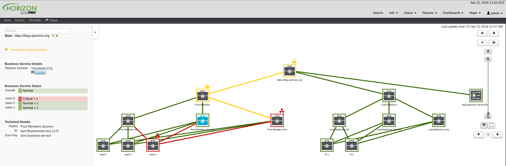

# Virtual Server Example

## Overview

This project provides an example of how a *virtual server* can be modeled using the *Business Service Monitoring* feature introduced in OpenNMS Horizon 18.

In particular, we show how events from multiple sources can be combined to provide an aggregated status for the service, and how such a service can be built using the available APIs.

## Screenshot



## Example Usage

```sh
./create-business-services-for-virtual-server.pl \
   --named 'https://blog.opennms.org' \
   --load-balanced-by 'lb-1' \
   --load-balanced-by 'lb-2' \
   --with-pool-member 'www-1' \
   --with-pool-member 'www-2' \
   --with-pool-member 'www-3'
```
